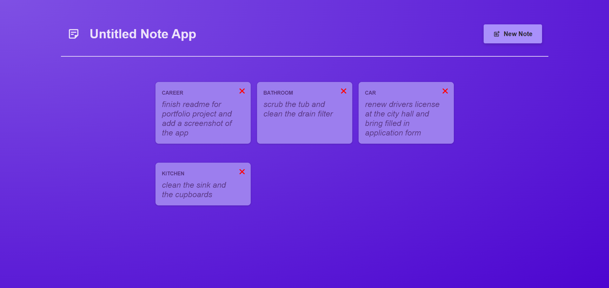

# Untitled Note App

A simple full-stack note-taking application built with React (frontend) and Express (backend). Easily create, view, edit, and delete notes. The app demonstrates modern React patterns and a RESTful backend API.



---

## Features

- Create, view, edit, and delete notes
- Responsive and modern UI
- Persistent storage using a JSON file on the backend
- Real-time backend status indicator
- Error handling for backend connectivity

---

## Getting Started

### Prerequisites

- [Node.js](https://nodejs.org/) (v18 or newer recommended)
- [npm](https://www.npmjs.com/)

---

### 1. Clone the Repository

```sh
git clone https://github.com/achrafreyani/untitled-note-app.git
cd untitled-note-app
```

---

### 2. Install Dependencies

#### Backend

```sh
cd backend
npm install
```

#### Frontend

```sh
cd ../frontend
npm install
```

---

### 3. Running the App

#### Start the Backend

```sh
cd backend
npm run dev
```
The backend server will start on [http://localhost:8080](http://localhost:8080).

#### Start the Frontend

Open a new terminal window/tab:

```sh
cd frontend
npm run dev
```
The frontend will start on [http://localhost:5173](http://localhost:5173) (or another port if 5173 is in use).

---

## How It Works

- **Frontend:** Built with React and Vite, the UI allows users to manage notes. All note data is fetched from and sent to the backend via HTTP requests.
- **Backend:** An Express server exposes a REST API for notes. Notes are stored in a JSON file (`backend/data/notes.json`).
- **API Endpoints:**
  - `GET /notes` — List all notes
  - `GET /notes/:id` — Get a single note
  - `POST /notes` — Create a new note
  - `PUT /notes/:id` — Update a note
  - `DELETE /notes/:id` — Delete a note

---

## Project Structure

```
untitled-note-app/
│
├── backend/
│   ├── app.js
│   ├── package.json
│   └── data/
│       ├── notes.js
│       └── notes.json
│
├── frontend/
│   ├── src/
│   ├── public/
│   │   └── screenshot.png
│   └── ...
│
└── readme.md
```

## Author

### Achraf Reyani